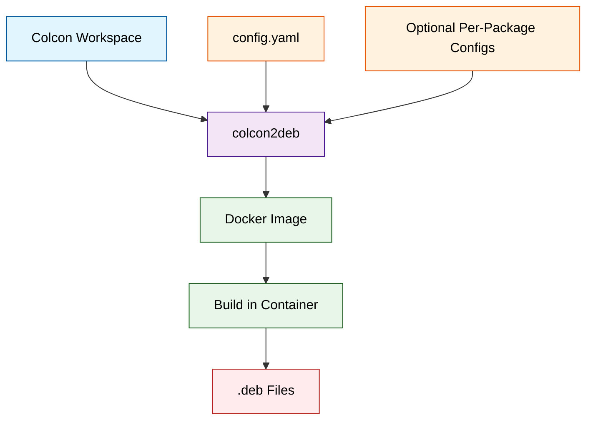

# colcon2deb

Build Debian packages from colcon workspaces using Docker containers.

## Overview

`colcon2deb` is a tool that converts ROS 2 packages in a colcon workspace into Debian packages. It runs the build process inside Docker containers to ensure a clean and reproducible build environment.

## Architecture



## Installation

### From Source

```bash
# Clone the repository
git clone https://github.com/NEWSLabNTU/colcon2deb.git
cd colcon2deb

# Build the wheel package
just build

# Install the wheel
just install
```

The `colcon2deb` command will be available in your PATH after installation.

## Quick Start

### Using Example Configurations

The easiest way to get started is using the provided examples with justfile automation:

```bash
# Navigate to an example directory
cd examples/autoware-2025.02-amd64

# Prepare the workspace (clone Autoware source)
git clone --branch 2025.02-ws https://github.com/NEWSLabNTU/autoware.git source
cd source && vcs import src < autoware.repos && cd ..

# Build using justfile
just build
```

The justfile will:
1. Build the Docker image if needed
2. Run colcon2deb with the pre-configured settings
3. Output Debian packages to the `build/` directory

### Manual Usage

1. **Prepare Your Colcon Workspace**

Create a ROS 2 workspace with your packages:

```
ros_ws/
├── src/
│   ├── my_package/
│   │   ├── package.xml
│   │   ├── CMakeLists.txt
│   │   └── ...
│   └── another_package/
│       ├── package.xml
│       └── ...
└── ...
```

2. **Create a Dockerfile**

```dockerfile
FROM ros:humble-ros-base

# Install build dependencies
RUN apt-get update && apt-get install -y \
    python3-colcon-common-extensions \
    python3-rosdep \
    && rm -rf /var/lib/apt/lists/*

# Initialize rosdep
RUN rosdep init || true
```

3. **Create a Configuration File**

```yaml
# config.yaml
version: 1

docker:
  dockerfile: Dockerfile
  image_name: my-builder

output:
  directory: ./build

packages:
  directory: ./debian-overrides

build:
  ros_distro: humble
```

4. **Run colcon2deb**

```bash
colcon2deb --workspace ros_ws/ --config config.yaml
```

## Configuration

### Docker Configuration

colcon2deb supports multiple Docker configuration options:

- **Remote Dockerfile**: Download and build from a URL
- **Local Dockerfile**: Build from a local Dockerfile
- **Pre-built Image**: Use an existing Docker image

### Build Options

| Option       | Description              | Default       |
|--------------|--------------------------|---------------|
| `ros_distro` | ROS distribution to use  | humble        |

### Package Overrides

You can override auto-generated Debian metadata for specific packages by creating a directory structure:

```
debian-overrides/
└── package_name/
    └── debian/
        ├── control
        ├── rules
        └── changelog
```

## Examples

### Autoware 0.45.1

```bash
cd examples/autoware-0.45.1-amd64
# Prepare workspace (see example README.md)
just build
```

### Autoware 2025.02

```bash
cd examples/autoware-2025.02-amd64
# Prepare workspace (see example README.md)
just build
```

Both examples include:
- Pre-configured `config.yaml`
- `Dockerfile` with required dependencies
- `justfile` for build automation
- Package-specific overrides in `debian-overrides/`

**Note**: Each example requires workspace preparation (cloning source code). See the `README.md` in each example directory for detailed instructions.

## Development

For developers and contributors, please see the [Development Guide](DEVELOPMENT.md) for:
- Setting up development environment
- Building and testing
- Project structure
- Contributing guidelines

## License

Apache License 2.0
