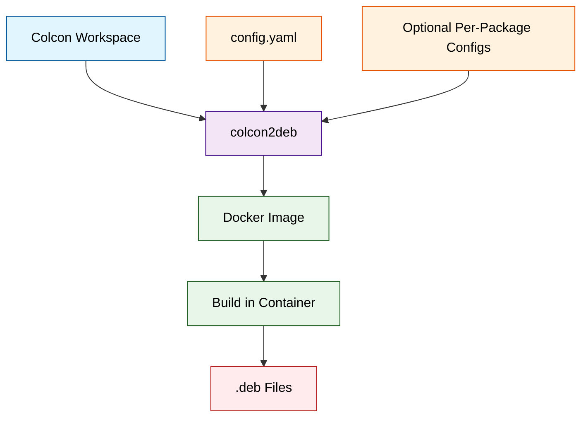

# colcon2deb

Build Debian packages from colcon workspaces using Docker containers.

## Overview

`colcon2deb` is a tool that converts ROS 2 packages in a colcon workspace into Debian packages. It runs the build process inside Docker containers to ensure a clean and reproducible build environment.

## Architecture



## Installation

### For Debian/Ubuntu Users (Recommended)

Download and install the pre-built Debian package from the [Releases page](https://github.com/NEWSLabNTU/colcon2deb/releases/tag/v0.2.0):

```bash
# Download the .deb package
wget https://github.com/NEWSLabNTU/colcon2deb/releases/download/v0.2.0/colcon2deb_0.2.0-1_all.deb

# Install the package
sudo apt install ./colcon2deb_0.2.0-1_all.deb
```

After installation, the `colcon2deb` command will be available system-wide.

### For Other Systems

For non-Debian/Ubuntu systems, use uv to run colcon2deb:

```bash
# Clone the repository
git clone https://github.com/NEWSLabNTU/colcon2deb.git
cd colcon2deb

# Install uv (if not already installed)
curl -LsSf https://astral.sh/uv/install.sh | sh

# Set up environment
uv sync

# Run colcon2deb
uv run colcon2deb --help
```

### Building from Source

If you want to build the Debian package yourself:

```bash
# Clone the repository
git clone https://github.com/NEWSLabNTU/colcon2deb.git
cd colcon2deb

# Build the Debian package
make deb

# Install the package
sudo apt install ./dist/colcon2deb_0.2.0-1_all.deb
```

## Quick Start

### Using Example Build Scripts

The easiest way to get started is using the provided example build scripts:

```bash
# Navigate to an example directory
cd examples/autoware-0.45.1-amd64

# Run the build script (clones Autoware and builds packages)
./build.sh
```

The build script will:
1. Clone the appropriate Autoware branch
2. Run colcon2deb with the pre-configured settings
3. Output Debian packages to the `build/` directory

### Manual Usage

1. **Prepare Your Colcon Workspace**

```bash
# Example using Autoware
git clone https://github.com/autowarefoundation/autoware.git
cd autoware
git checkout 2025.02

# Import dependencies
mkdir src
vcs import src < autoware.repos
```

2. **Create a Configuration File**

```yaml
# config.yaml
version: 1

docker:
  # Option 1: Use a remote Dockerfile
  dockerfile: https://raw.githubusercontent.com/NEWSLabNTU/autoware-build-images/main/0.45.1/amd64/Dockerfile
  image_name: autoware-builder
  
  # Option 2: Use a pre-built image
  # image: ros:humble-ros-base

output:
  directory: ./build

packages:
  directory: ./debian-overrides

build:
  ros_distro: humble
  parallel_jobs: 8
  skip_tests: true
```

3. **Run colcon2deb**

```bash
# If installed via Debian package
colcon2deb --workspace /path/to/autoware --config config.yaml

# If using uv
uv run colcon2deb --workspace /path/to/autoware --config config.yaml
```

## Configuration

### Docker Configuration

colcon2deb supports multiple Docker configuration options:

- **Remote Dockerfile**: Download and build from a URL
- **Local Dockerfile**: Build from a local Dockerfile
- **Pre-built Image**: Use an existing Docker image

### Build Options

| Option          | Description                     | Default          |
|-----------------|---------------------------------|------------------|
| `ros_distro`    | ROS distribution to use         | Auto-detected    |
| `parallel_jobs` | Number of parallel build jobs   | System CPU count |
| `skip_tests`    | Skip running tests during build | false            |

### Package Overrides

You can override auto-generated Debian metadata for specific packages by creating a directory structure:

```
debian-overrides/
└── package_name/
    └── debian/
        ├── control
        ├── rules
        └── changelog
```

## Examples

### Autoware 0.45.1

```bash
cd examples/autoware-0.45.1-amd64
./build.sh
```

### Autoware 2025.02

```bash
cd examples/autoware-2025.02-amd64
./build.sh
```

Both examples include:
- Pre-configured `config.yaml`
- Build script that clones Autoware
- Package-specific overrides in `debian-overrides/`

## System Requirements

- Python >= 3.10
- Docker or Docker CE
- python3-yaml, python3-docker, python3-requests (installed automatically with Debian package)

## Known Issues

- Large workspaces may take significant time to build
- Consider using `skip_tests: true` in configuration to speed up builds
- Docker permission errors: Add user to docker group with `sudo usermod -aG docker $USER`

## Development

For developers and contributors, please see the [Development Guide](DEVELOPMENT.md) for:
- Setting up development environment
- Building and testing
- Project structure
- Contributing guidelines

## Docker Images

Pre-configured Docker images for various architectures are available at:
https://github.com/NEWSLabNTU/autoware-build-images

Supported configurations:
- Ubuntu 22.04 with ROS 2 Humble
- Architectures: amd64, arm64, jetpack
- Autoware versions: 0.45.1, 2025.02

## Support

For issues, feature requests, and contributions, please visit:
https://github.com/NEWSLabNTU/colcon2deb

## License

Apache License 2.0
